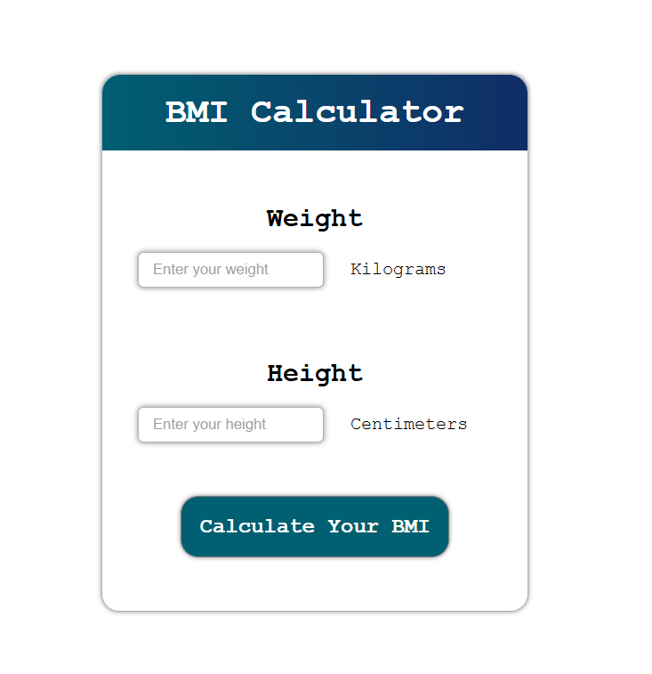

# 🧮 BMI Calculator

A simple, responsive Body Mass Index (BMI) calculator built with HTML, CSS, and JavaScript.  
This tool allows users to input their weight and height, then calculates their BMI and displays their health category.

---

## 📷 Screenshot



---

## 🚀 Live Demo

> You can try it live here: [https://mohamed-ahmed-137.github.io/BMI/](https://mohamed-ahmed-137.github.io/BMI/)

---

## 📦 Features

- Input weight in **kilograms**
- Input height in **centimeters**
- Calculates BMI and classifies it into:
  - Underweight
  - Healthy
  - Overweight
  - Obesity
- Responsive and clean UI
- Validates input to prevent empty or invalid values

---

## 🛠️ Technologies Used

- **HTML5**
- **CSS3** (Flexbox + responsive design)
- **JavaScript (Vanilla JS)**

---

## 💡 How It Works

1. User inputs their weight (kg) and height (cm).
2. When clicking the **"Calculate Your BMI"** button, the script calculates:
3. The result is shown below the button with a classification message.

---

## ✅ Example Output

```txt
Your BMI is: 23.45 (Healthy)
```
